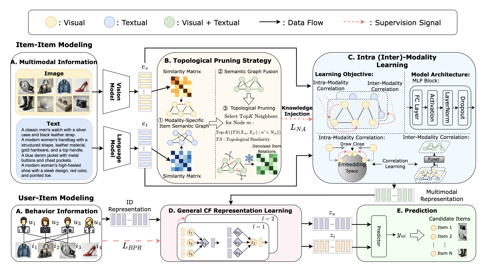

# TMLP(AAAI'25)

This repository contains the PyTorch implementation for our research paper presented at AAAI 2025:

**Title:** Beyond Graph Convolution: Multimodal Recommendation with Topology-aware MLPs  
**Authors:** Junjie Huang, Jiarui Qin, Yong Yu, Weinan Zhang. [Paper](https://arxiv.org/abs/2412.11747).  

## Overview
We present TMLP, a topology-aware MLP framework for multimodal recommendations. TMLP enhances scalability by integrating topological dependencies into MLPs and employs pruning strategy to improve robustness. 
<p>

</p>

## Data
The dataset is available for download via [Google Drive](https://drive.google.com/drive/folders/1BxObpWApHbGx9jCQGc8z52cV3t9_NE0f?usp=sharing).
The data includes text and image features extracted using Sentence-Transformers and VGG-16, and has been published within the [MMRec](https://github.com/enoche/MMRec) framework.

## Usage
1. Place the downloaded data (e.g., "baby") into the `data/` directory.  
2. Navigate to `src/utils` and run `python tps.py` to perform topological pruning. We provide an example of the generated denoised item-item relations for the Sports dataset in the `data/` folder. For more details, refer to the [paper](https://arxiv.org/abs/2203.12265).  
3. Navigate to `src/` and run `python main.py` to conduct intra- and inter-modality learning.
You may specify other parameters in `src/configs/model/TMLP.yaml`.

## Citation
```
@article{huang2024beyond,
  title={Beyond Graph Convolution: Multimodal Recommendation with Topology-aware MLPs},
  author={Huang, Junjie and Qin, Jiarui and Yu, Yong and Zhang, Weinan},
  journal={arXiv preprint arXiv:2412.11747},
  year={2024}
}
```